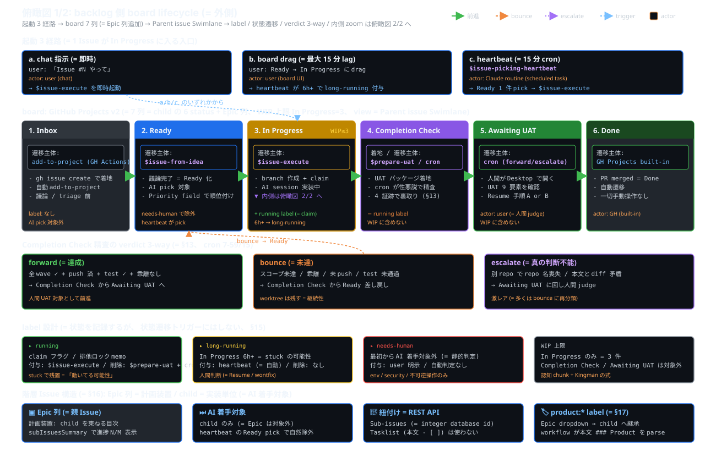
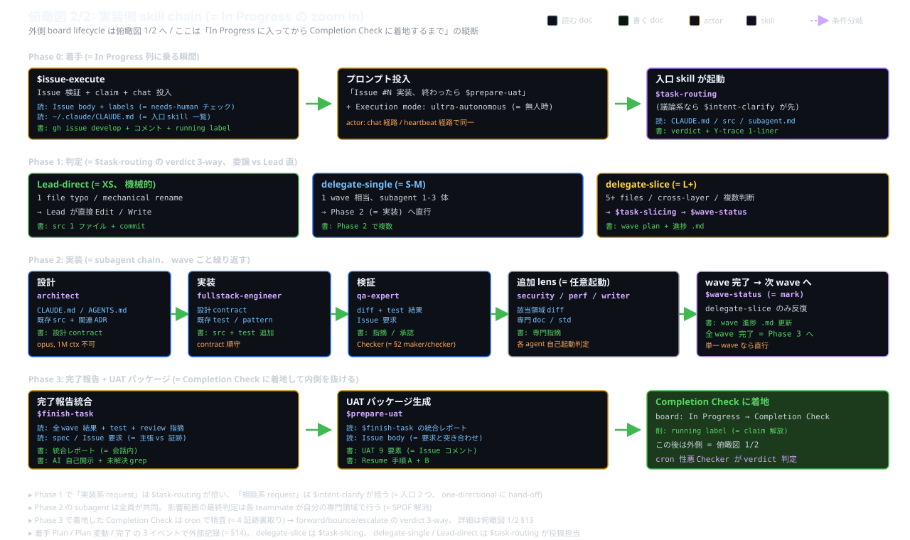

# 俯瞰図 (= harness の全体像 2 枚)

harness の構造を 2 枚の SVG で俯瞰する。 [`harness-design.md`](../harness-design.md) §11 から参照される。

## どの図がどの疑問に答えるか

| 疑問 | 図 |
|---|---|
| 「要求 (= Issue) が board 上でどう動くのか?」 「stuck / WIP / label の関係は?」 | [`backlog-lifecycle.svg`](backlog-lifecycle.svg) (= 外側、 backlog プロジェクト例) |
| 「In Progress に入ってから何が起きてるのか?」 「subagent chain の各段で何の doc を読み書きしてる?」 | [`inner-skill-chain.svg`](inner-skill-chain.svg) (= 内側、 vendor 非依存) |

外側図は backlog プロジェクト固有 (= GitHub Projects v2 + 7 列 board (= child 6 status + Epic 列) + Parent issue Swimlane + 3 起動経路 + label 設計 + 階層 Issue 構造) の参考例。 別プロジェクトでは外側のシェイプが変わる (= 例: 単発 chat タスクは外側レイヤーなし、 内側 skill chain だけが走る)。 一方、 内側図は **どのプロジェクトでも共通**。

## 1. backlog 側 board lifecycle (= 外側、 参考例)

### 図の読み方

- **起動 3 経路** (= a. chat 指示 / b. board drag / c. heartbeat): どの経路でも In Progress 列に着地
- **board 7 列** (= Inbox → Ready → In Progress → Completion Check → Awaiting UAT → Done + **Epic** 列): child Issue は 6 status を巡回、 Epic Issue は `Epic` 列に常駐 (= 計画装置)
- **verdict 3-way** (= forward / bounce / escalate): Completion Check から離脱
- **label 設計** (= running / long-running / needs-human): 状態を記録、 状態遷移トリガーには使わない (= §9 仕様 / §15 方針)
- **WIP 上限** = 3 件 (= **In Progress のみ**、 Completion Check / Awaiting UAT は対象外)
- **階層 Issue 構造** (= §16): Epic ↔ child を GitHub Sub-issues で紐付け、 board view は **Parent issue Swimlane** で Epic ごとに横 row 表示。 child の `product:*` ラベルは親 Epic から継承 (= §17)

### 凡例

- 緑矢印 = 前進
- 橙破線 = bounce
- 紫破線 = escalate
- 青破線 = trigger

## 2. 内側 skill chain (= vendor 非依存、 全プロジェクト共通)

### 図の読み方

- **Phase 0** (= 着手): boundary skill が claim + chat 投入 → 入口 skill (= `$task-routing` / `$intent-clarify`) 起動
- **Phase 1** (= 判定): verdict 3-way (= Lead-direct / delegate-single / delegate-slice)
- **Phase 2** (= 実装): subagent chain (= architect → fullstack-engineer → qa-expert + 任意 lens) を wave ごとに反復
- **Phase 3** (= 完了報告): `$finish-task` + boundary skill (= 例: `$prepare-uat`) で外側に return

各段で **読む doc** (= 青) / **書く doc** (= 緑) / **actor** (= 橙) を併記、 doc の出入りが追える。

### 凡例

- 青枠 = 読む doc
- 緑枠 = 書く doc
- 橙枠 = actor (= 人間 or AI process)
- 紫枠 = skill 名
- 紫破線 = 条件分岐

## 参考

- [`../harness-design.md`](../harness-design.md): 全体設計仕様 (= 工学原則 / 多層防御 / 構造 / workflow / session 透明性 / 採用判断 / 階層 Issue / product label、 17 節)
- 図の更新時はソース (= SVG XML) を直接編集する。 ダーク背景前提の絶対色指定 (= CSS variable に依存しない)。
